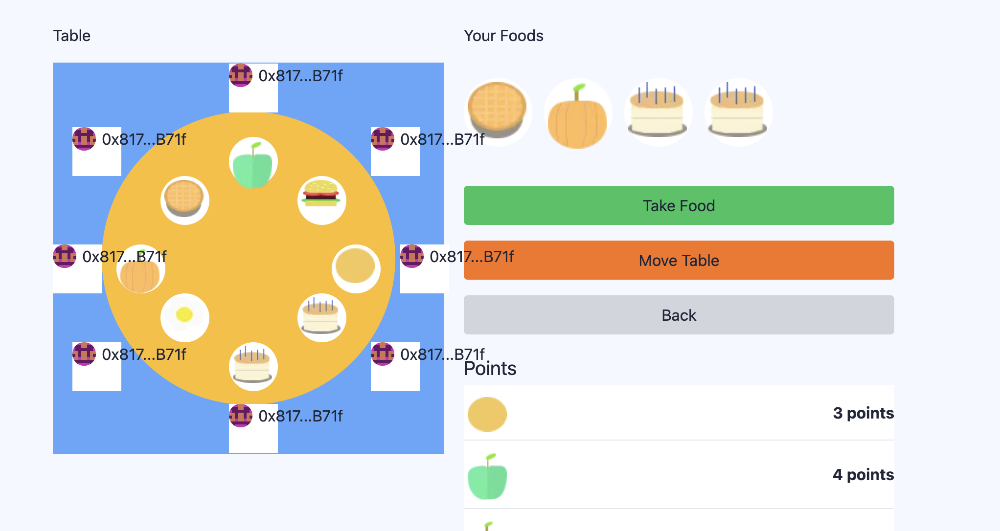

# Food Frenzy Feast

An on-chain game where players choose 10 random foods from a table and receive bonus points for matching foods


⚙️ Built using NextJS, RainbowKit, Hardhat, Wagmi, and Typescript.
## Gameplay
<h3>To win:</h3>
<p>
  Earn the highest score by strategically selecting 10 random foods from the table, matching them for
  bonus points
</p>
<h3>Gameplay:</h3>
<ul>
  <li>A table is set with an assortment of random foods, each assigned different point values</li>
  <li>Earn bonus points by matching identical food items</li>
  <li>When a food is taken, a new random one is replaced</li>
  <li>You can rotate the table to the right</li>
</ul>

## Requirements

Before you begin, you need to install the following tools:

- [Node (v18 LTS)](https://nodejs.org/en/download/)
- Yarn ([v1](https://classic.yarnpkg.com/en/docs/install/) or [v2+](https://yarnpkg.com/getting-started/install))
- [Git](https://git-scm.com/downloads)

## Quickstart

To get started with Food Frenzy Feast, follow the steps below:

1. Clone this repo & install dependencies

```
git clone https://github.com/codechefsong/Food-Frenzy-Feast.git
cd Food-Frenzy-Feast
yarn install
```

2. Run a local network in the first terminal:

```
yarn chain
```

This command starts a local Ethereum network using Hardhat. The network runs on your local machine and can be used for testing and development. You can customize the network configuration in `hardhat.config.ts`.

3. On a second terminal, deploy the test contract:

```
yarn deploy
```

This command deploys a test smart contract to the local network. The contract is located in `packages/hardhat/contracts` and can be modified to suit your needs. The `yarn deploy` command uses the deploy script located in `packages/hardhat/deploy` to deploy the contract to the network. You can also customize the deploy script.

4. On a third terminal, start your NextJS app:

```
yarn start
```

Visit your app on: `http://localhost:3000`. You can interact with your smart contract using the `Debug Contracts` page. You can tweak the app config in `packages/nextjs/scaffold.config.ts`.
